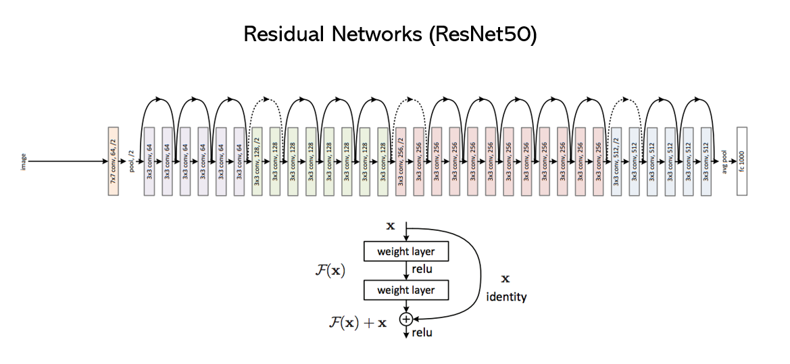

# Implementing ResNet50 From Scratch  - Tensorflow / Keras
This repository implements the basic building blocks of Deep Residual networks which is trained to detect numbers on hand images

This project was completed for "Convolutional Neural Networks" course by Coursera and deeplearning.ai (part of [Deep Learning Specialization](https://www.coursera.org/specializations/deep-learning) taught by Prof. Andrew Ng)

# ResNet Intuition

As a Neural Network gets very deep, vanishing / exploding gradients become a huge problem. ResNet solves this by using **“Skip Connections”** where layer 1 output goes directly to layer N input. 

The concept of “Residual Block”:

<caption>
  SIGNS dataset (src: Coursera)
</caption>

Output of layer l (Al ) gets added to layer l+2 "before" the nonlinear activation is applied at layer l+2.

If we have a very deep plain network, the training error increases as you build more layers while in theory it is expected to decrease. ResNet allows you to decrease the training error for more layers that you add.

To build a ResNet, take a plain (regular) CNN and keep adding skip connections and SAME convolutions, to match the conv shapes. 

# Dataset

The model is trained on SIGNS dataset that contains hand images that represents Digit Signs starting from 0 to 5. A sample image is shown below

<caption>
  SIGNS dataset (src: Coursera)
</caption>

# References

ResNet algorithm due to He et al. (2015). The implementation here also took significant inspiration and follows the structure given in the GitHub repository of Francois Chollet: 

- Kaiming He, Xiangyu Zhang, Shaoqing Ren, Jian Sun - [Deep Residual Learning for Image Recognition (2015)](https://arxiv.org/abs/1512.03385)
- Francois Chollet's GitHub repository: https://github.com/fchollet/deep-learning-models/blob/master/resnet50.py

